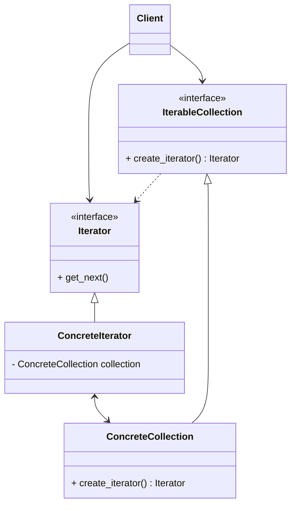

## 迭代器模式

### 概述

### 类图

```mermaid
classDiagram
    class Client {
        
    }
    
    class Iterator {
        <<interface>>
        
        + get_next()
    }
    
    class IterableCollection {
        <<interface>>
        
        + create_iterator() Iterator
    }
    
    class ConcreteIterator {
        - ConcreteCollection collection 
    }
    
    class ConcreteCollection {
        + create_iterator() Iterator
    }
    
    Client --> Iterator
    Client --> IterableCollection
    IterableCollection ..> Iterator 
    Iterator <|-- ConcreteIterator 
    IterableCollection <|-- ConcreteCollection
    ConcreteIterator <--> ConcreteCollection
```