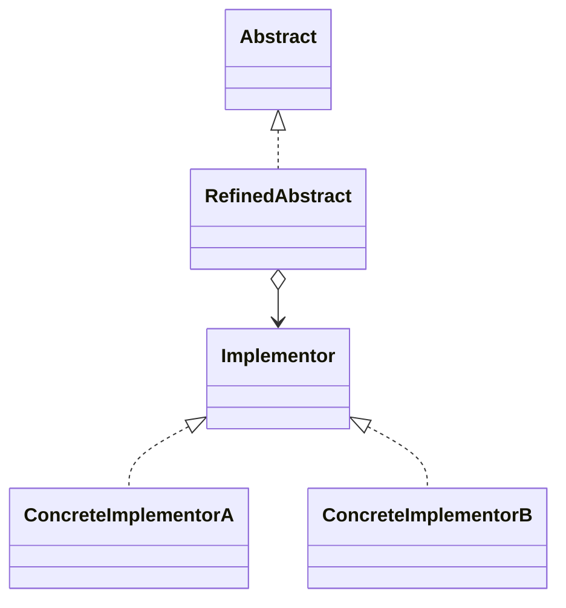

## 桥接模式

### 概述

### 类图

```mermaid
classDiagram
    class Abstract {
        
    }
    
    class RefinedAbstract {
        
    }
    
    class Implementor {
        
    }
    
    class ConcreteImplementorA {
        
    }

    class ConcreteImplementorB {

    }
    
    Abstract <|.. RefinedAbstract
    Implementor <|.. ConcreteImplementorA
    Implementor <|.. ConcreteImplementorB
    RefinedAbstract o--> Implementor
    
```