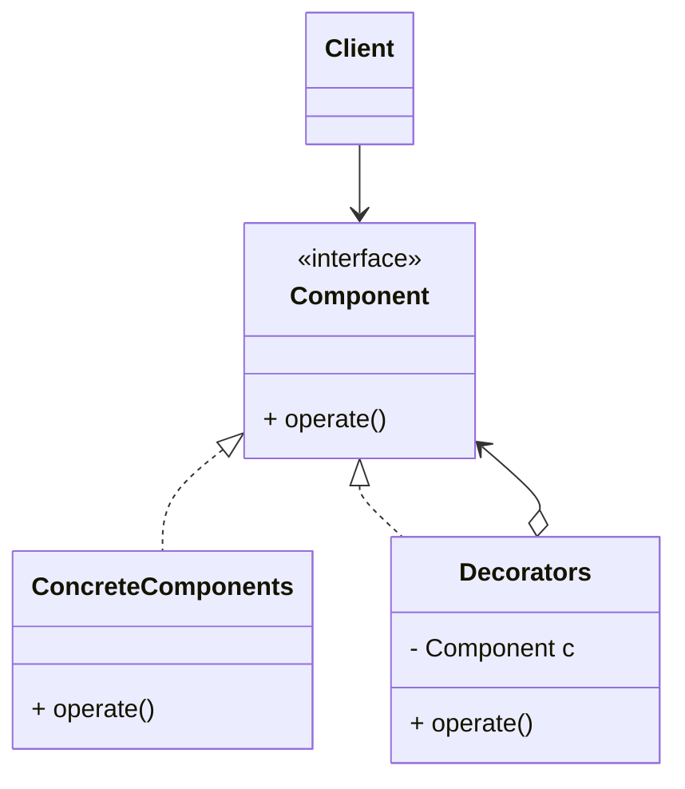

## 装饰器模式

### 概述

### 类图

```mermaid
classDiagram
    class Client {
        
    }
    
    class Component {
        <<interface>>
        
        + operate()
    }
    
    class ConcreteComponents {
        + operate()
    }
    
    class Decorators {
        - Component c
        
        + operate()
    }
    
    Client --> Component
    Component <|.. ConcreteComponents
    Component <|.. Decorators
    Decorators o--> Component
```