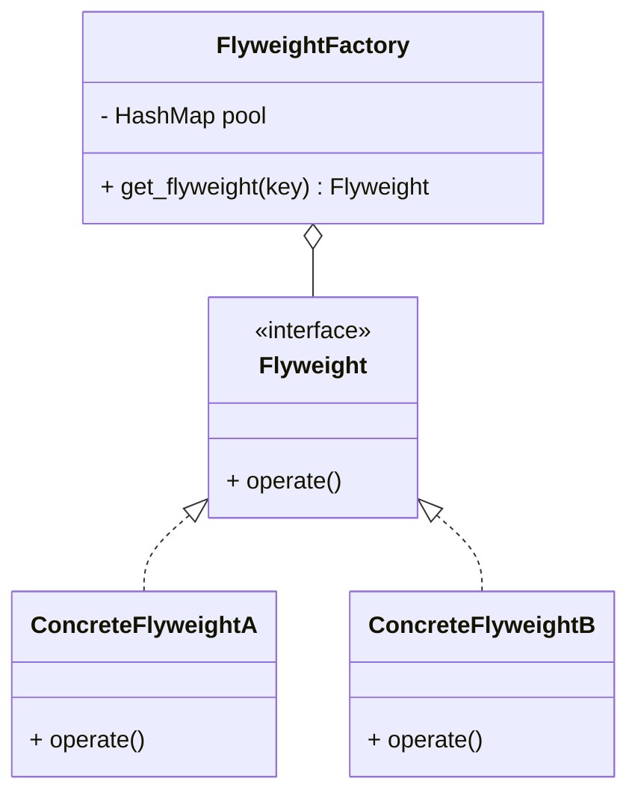

## 享元模式

### 概述
摒弃在每个对象中保存所有数据的方式，通过共享多个对象共有的相同状态，达到在有限的内存中载入更多对象的目的。

享元模式和单例模式在某些方面有相似之处，但它们的目标和使用场景有所不同。 
单例模式的目标是保证一个类只有一个实例，并提供一个全局访问点。这个模式经常被用在对于全局唯一实例的情况，比如配置管理、线程池、缓存等。
享元模式的目标则是通过与其他类似对象共享数据来最小化内存使用。它经常被用在需要处理大量类似对象，且这些对象的大部分状态都可以外部化的场景。
他们的相似之处在于，都涉及到了对象的共享使用。然而，单例模式通常用于一个特定的类只能创建一个实例，而享元模式用于一个类可以创建多个实例，但是当实例有相同的状态时，会尽量让他们共享使用。

如果需要保证只创建一个对象并全局通用，可能需要单例模式；如果需要处理大量的细粒度对象并希望共享他们的部分状态来节省内存，可能需要享元模式。

### 类图

